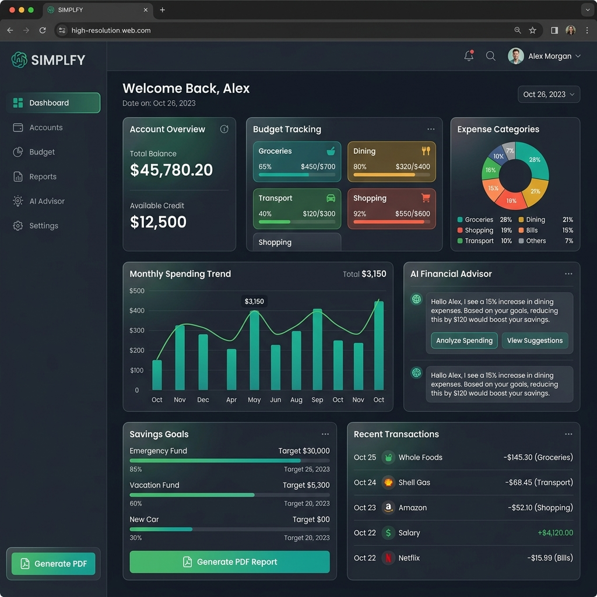

<div align="center">
  

  <br />
  <br />

  # 🚀 Aarjav Jain —  Portfolio
  
  **AI & ML Engineer • Computer Vision Developer • Full-Stack Developer**
  
  [](https://nextjs.org/)
  [](https://threejs.org/)
  [](https://greensock.com/gsap/)
  
  <p align="center">
    A cinematic, highly interactive, and visually striking portfolio demonstrating expertise in Artificial Intelligence, Machine Learning, and Modern Full-Stack Development.
  </p>

  ### [🔗 View Live Portfolio Here](https://aarjav-jain-2210.github.io/PORTFOLIO/)
</div>

<br />

## ✨ Core Features

- **Cinematic Experience**: Immersive auto-playing video background with sound toggle and custom glassmorphism overlays.
- **Scroll-Driven Storytelling**: Utilizing custom `ScrollRevealText` and intersection observers to organically reveal content as you scroll.
- **Dynamic Projects Showcase**: Featuring AI-driven projects like *Project Drishti (YOLOv8)* and *Behavioral Customer Segmentation* with high-res mockups.
- **Interactive Terminal UI**: A realistic, blinking-cursor terminal interface detailing current tech focus and roles.
- **Performance Optimized**: Built on Next.js 15 App Router with zero-layout-shift (CLS) techniques and fully responsive fluid typography.

## 🛠️ Tech Stack

| Domain | Technologies |
| :--- | :--- |
| **Framework** | Next.js 15, React 19 |
| **Styling** | Vanilla CSS Modules (Glassmorphism, Fluid Layouts) |
| **Animations** | GSAP, Three.js, Custom Intersection Observers |
| **AI/ML Focus** | PyTorch, TensorFlow, OpenCV, YOLOv8, Scikit-Learn |
| **Deployment** | GitHub Pages (Static Export) |

## 🚀 Quick Start (Local Development)

To run this portfolio locally:

```bash
# Clone the repository
git clone https://github.com/Aarjav-Jain-2210/PORTFOLIO.git

# Navigate to the site directory
cd PORTFOLIO/portfolio-site

# Install dependencies
npm install

# Start the development server
npm run dev
```

Open [http://localhost:3000](http://localhost:3000) in your browser to see the result.

## 📂 Project Structure

```text
PORTFOLIO/
├── portfolio-site/
│   ├── app/
│   │   ├── components/       # Reusable UI components (Hero, About, Projects, etc.)
│   │   ├── styles/           # Modular CSS files for each section
│   │   ├── layout.js         # Root layout structure
│   │   └── page.js           # Main landing page
│   ├── public/               # Static assets (videos, images, resume)
│   └── next.config.mjs       # Next.js configuration
└── README.md                 # Project documentation
```

<br />

<div align="center">
  <p>Designed & Built by <b>Aarjav Jain</b></p>
  
  [](https://www.linkedin.com/in/aarjavjjain/)
  [](https://github.com/Aarjav-Jain-2210)
</div>
